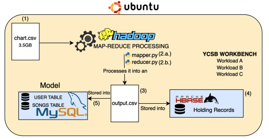
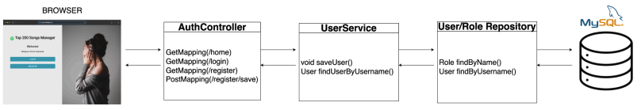

# Spotify Big Data Pipeline & Commercial Manager

### Project Overview
This project is an end-to-end data engineering and full-stack solution designed to process a 3.5GB dataset containing over 25 million Spotify chart records (2017–2021). The system ingests raw unstructured data, cleans it using distributed processing, and serves it through a secure, commercial-grade web application.

### System Architecture

The system is built on a distributed data pipeline that handles the flow from raw files to the final user interface:

1.  **Ingestion:** The process begins with a raw 3.5GB CSV file containing millions of global song rankings.
2.  **Processing (MapReduce):** A Hadoop cluster executes custom Python mapper and reducer scripts. This layer filters out non-ASCII characters and removes duplicates in parallel, transforming the massive raw file into a clean dataset.
3.  **Hybrid Storage Model:**
    * **HBase:** Acts as the NoSQL store for the high-volume processed data.
    * **MySQL:** Serves as the relational database for the commercial application. A custom Python loader script automates the parsing and insertion of data from the pipeline into the SQL tables.
4.  **Benchmarking:** To ensure reliability, the HBase storage was stress-tested using the YCSB (Yahoo! Cloud Serving Benchmark) to analyze performance under heavy read/write workloads.

### Security & Application Flow

The web platform is engineered using Spring Boot with a focus on secure access control:

* **Request Interception:** Every request made from the browser is intercepted by the Spring Security filter chain before it reaches the application logic.
* **Authentication Check:** The system verifies the user's identity against encrypted credentials stored in the MySQL database.
* **Role-Based Access:** Once authenticated, the system enforces role-based permissions. It ensures that only authorized users can pass through to the Controllers.
* **MVC Execution:** Validated requests are routed to the specific Controller, which then interacts with the Service layer to perform CRUD operations on the data.

### Key Technical Features
* **Big Data ETL:** Automated Python scripts running on Hadoop to sanitize and migrate millions of records.
* **Optimized Performance:** Implemented server-side pagination to efficiently render large datasets in the browser without latency.
* **Performance Analysis:** Validated database configuration and throughput using industry-standard YCSB workloads (A, B, and C).

### Tech Stack
* **Language:** Java (Spring Boot), Python.
* **Big Data:** Hadoop MapReduce, HBase.
* **Database:** MySQL.
* **Tools:** YCSB, Linux (Ubuntu), Git.
